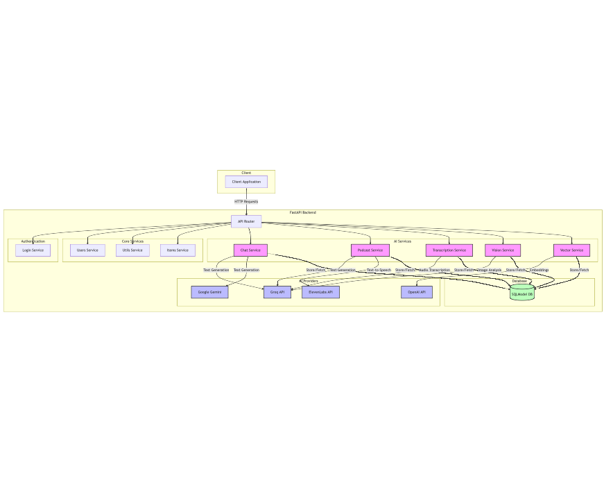
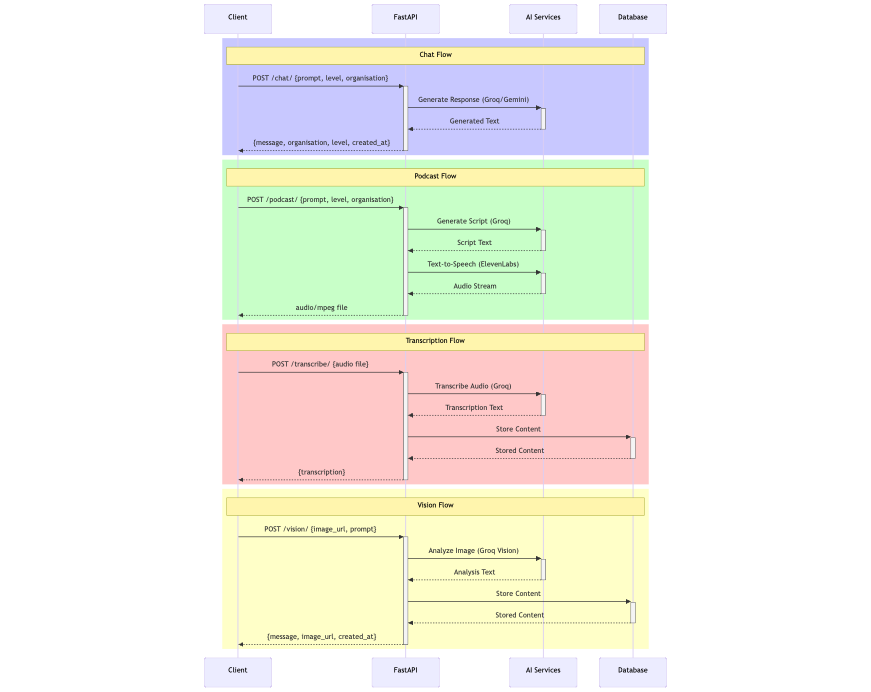
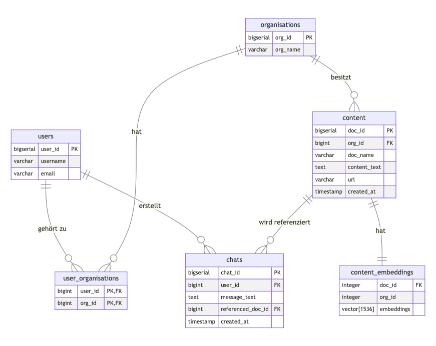

# YS

## Beschreibung

Unser Projekt YS (*wise, why's*) ist eine Applikation rund um das effiziente Sammeln, Strukturieren und Verfügbarmachen von Wissen.

Dazu verwenden wir eine WebApp, die es ermöglicht, Wissen in Form von Texten, Bildern, Videos und Audiodateien zu sammeln und zu strukturieren. Zusätzlich wird das Wissen graphisch dargestellt, indem wir die Bedeutung des Wissens als hochdimensionalen Vektor extrahieren und auf einen 2D-Raum projezieren. Als weitere Möglichkeit kann mit der Wissensbasis über ein Chatbot-Interface kommuniziert werden, sowohl in Textform als auch über Sprache.

## Installation

```bash
git clone https://github.com/object-Object-42/webapp
cd WebApp
```

## Verwendete Technologien

- FastAPI
- React
- Docker
- PostgreSQL

## Verwendete KI-Modelle

- LLaMa-3.1-70B
- LLaMa-3.2-90B-Vision
- eleven_turbo_v2_5
- whisper-large-v3-turbo
- text-embedding-3-small

## Verwendetes Template

- [Full Stack FastAPI Template](https://github.com/fastapi/full-stack-fastapi-template)

## API Dokumentation

### API Endpunkte



### KI-Endpunkte



## Datenstruktur

